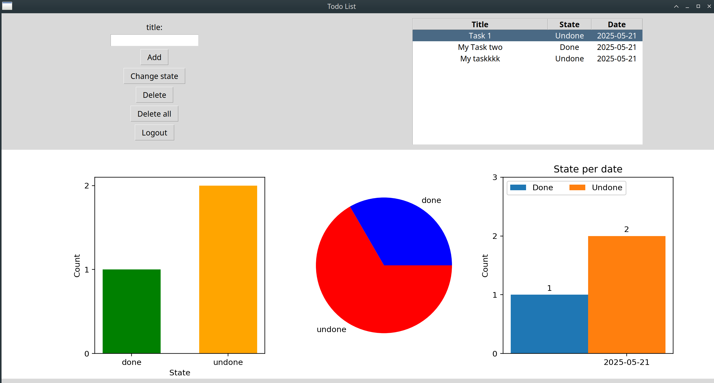

# py-todo-visual

A simple and visual to-do list application built with Python and Tkinter. This app allows you to manage your tasks and visualize progress using charts.

## Screenshot



## Features

- User-friendly graphical interface using Tkinter
- Add, edit, and delete tasks
- Mark tasks as completed
- Visual representation of task status with charts
- Save data to database
- Multiple user support

## Requirements

- Python 3.7 or higher
- Python libraries (`tkinter`, `numpy`, `sqlite`, `matplotlib`)

## Usage

1. Clone the repository:

   ```bash
   git clone https://github.com/mr-seha/py-todo-visual.git
   cd py-todo-visual
   ```

2. Run the app:

   ```bash
   python todolist_v2.0.py
   ```

## How to Use

- Enter a task in the input field and click "Add" to include it in your list.
- Click a task and change state to mark it as "Done" or "Undone".
- Select a task and click "Delete" to remove it.

---

_Developed by **Mohammadreza Souri**_
